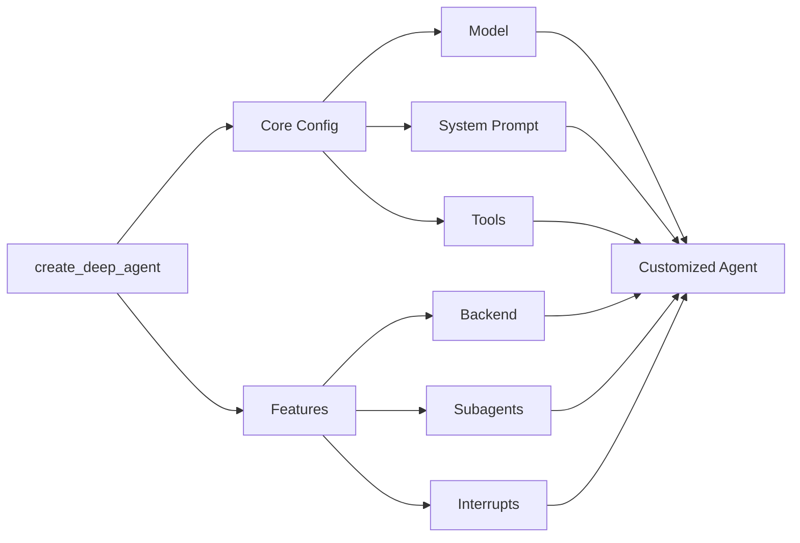

# Session 7: 📶 Deep Agents

🎯 Understand how to build complex agents that operate over longer time horizons.

📚 **Learning Outcomes**
- Learn the four key elements of Deep Agents and how to implement them, including planning and task decomposition, context management, subagent spawning, and long-term memory
- Learn to use skills with DeepAgents

🧰 **New Tools**
- Orchestration: [Deep Agents](https://docs.langchain.com/oss/python/deepagents/overview), [deepagents-cli](https://github.com/langchain-ai/deepagents/tree/master/libs/deepagents-cli) 

## 📛 Required Tooling & Account Setup
- [Antropic API Key](https://platform.claude.com/login?returnTo=%2Fsettings%2Fkeys)
   
## 📜 Recommended Reading

1. [Deep Agents](https://blog.langchain.com/deep-agents) (July 2025)
2. [The Claude Agent SDK](https://www.anthropic.com/engineering/building-agents-with-the-claude-agent-sdk) (September 2025)
3. [Doubling down on DeepAgents](https://blog.langchain.com/doubling-down-on-deepagents) (Oct 2025)
4. [Using skills with DeepAgents](https://blog.langchain.com/using-skills-with-deep-agents) (Nov 2025)

# 🗺️ Overview

In session 7, we go deeper into agents. What is a deep agent, exactly, and what's the difference between shallow and deep agents? What is the difference between leveraging deep agents (like Claude Code or Deep Research; i.e., _using deep agent tools_) versus _building deep agent tools_ for others to use? How does this bring together everything we've learned so far? We'll get into it today!

The core concept of the day is relatively simple: shallow agents fail to plan and act over longer, more complex, multi-step tasks. Deep agents, on the other hand, do not. The idea of a "deep agent" was inspired by apps like Claude Code, Deep Research, and Manus. 

The code is quite interesting today, and forms the basis for the open Deep Research implementation we'll study later this week. Implementation of planning and task decomposition, context management strategies, subagent spawning, and our good friend, long-term memory, are the essential elements of how we add depth to an agentic system. [deepagents](https://pypi.org/project/deepagents/) is a standalone library that we'll use in addition to the core LangChain and LangGraph tooling we've learned so far.

# 📶 Deep Agents

> **Tip:** For building simpler agents, consider using LangChain’s `create_agent` or building a custom LangGraph workflow [Ref].

Over the past few years, an interesting pattern has emerged: `the top consulting use cases become a feature in the apps built by leading LLM model providers (and now leading agent labs)`. 

While from 2024 to 2025 we saw it play out with Report Generation into Deep Research tooling, we might also point out that from 2023 to 2024 we saw a similar evolution with respect to to code generation, which continues to be an absolutely killer use case for emerging productions/companies in Silicon Valley, including [Cursor](https://cursor.com/en)/[Anysphere](https://anysphere.inc/) and [Devin](https://devin.ai/)/[Cognition](https://cognition.ai/) (acquirers of the [Windsurf](https://cognition.ai/blog/windsurf) team), and others. It’s worth mentioning that [ChatGPT Codex](https://openai.com/index/introducing-upgrades-to-codex/) and [Claude Code](https://claude.com/product/claude-code) fit into this hierarchy of different levels of [Coding Agents](https://www.youtube.com/live/S0EwhDf94JI?si=vUchjUL_NDoRrwuO&t=644) as well.

Deep agents as a concept was born out of looking around at the tools that had succeeded (i.e., that just "worked") and that caught fire in the markeplace, and trying to pattern-match across the things that made them powerful.

> "All of the major model providers have an agent for Deep Research and for “async” coding tasks." [[Ref](https://www.blog.langchain.com/deep-agents/)]

The killer apps of AI to date have been coding and research agents. What do they share? The deepagents framework identifies four things: Planning, context management, subagent spawning, and long-term memory. 

The basic Deep Agent frame can be visualized like this:

Interestingly, the only thing that's really new for us here is planning.

# On Planning

Planning is a superpower, for humans and agents alike.

> Rule #29: PLAN ALL THE WAY TO THE END
> The ending is everything. Plan all the way to it, taking into account all the possible consequences, obstacles, and twists of fortune that might reverse your hard work and give the glory to others. By planning to the end you will not be overwhelmed by circumstances and you will know when to stop. Gently guide fortune and help determine the future by thinking far ahead. ~ Robert Greene, [The 48 Laws of Power](https://irp-cdn.multiscreensite.com/cb9165b2/files/uploaded/The+48+Laws+Of+Power.pdf)

With a good enough plan, you can direct each unit of work to its appropriate end to add up to the larger result you're looking to achieve.

Planning stems directly from reasoning, which grew out of the idea of a Chain of Thought (CoT) that we saw in session 1!. This idea of increasing test-time compute appropriately is what we're playing with when developing a plan; finding the line between thinking _enough_ about the plan, but not overthinking and never taking appropriate action. Then, when we take action, how many things should we do or look to observe? This is where subagent spawning and parallelization can come in handy, but can also be overdone.

Deep agents provide an automation platform for us to play with these ideas, to implement prototypes, and see how they plan and act over longer time horizons.

It's hard to build deep agents that work. This is why coding agents and Deep Research tools have been such standout successes. 

What will be next?

# The Future of Deep Agents
As we're seeing play out rapidly across the landscape, these coding agents are _so good at completing tasks that can be verified_, they're moving beyond coding.

> Over the past several months, Claude Code has become far more than a coding tool. At Anthropic, we’ve been using it for deep research, video creation, and note-taking, among countless other non-coding applications. ~ [Building agents with the Claude Agent SDK](https://www.anthropic.com/engineering/building-agents-with-the-claude-agent-sdk)

> Anyone who can describe a problem ... can build a solution. ~ [How Anthropic teams use Claude Code](https://claude.com/blog/how-anthropic-teams-use-claude-code)

The future of how exactly we use agents that plan, gather context, manage context, take actions, spawn sub-workers, evaluate themselves and their subagents, verify the outputs of their work, coordinate with other deep agents is, well, exactly what you need to figure out for your companies!
