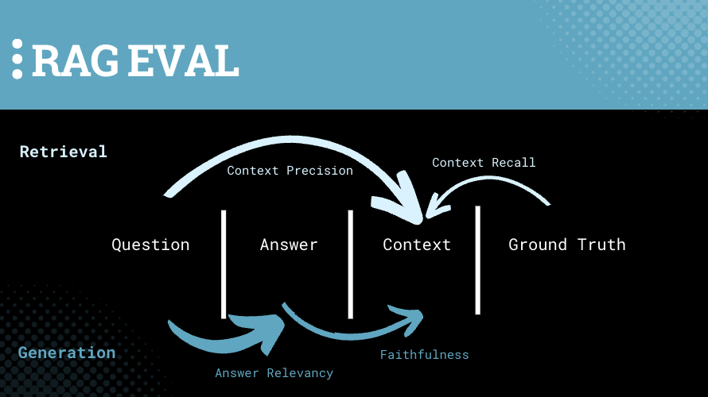

# Session 10: 📊 Agentic RAG Evaluation

🎯 Learn to set up and implement effective evals for agents and RAG applications.

- Build an Agentic RAG application with LangGraph
- Learn to evaluate RAG and Agent applications quantitatively with the RAG ASsessment (RAGAS) framework
- Use metrics-driven development to improve agentic applications, measurably, with RAGAS 

🎯 Learn to set up and implement effective evals for agents and RAG applications.

📚 **Learning Outcomes**
- Build an Agentic RAG application with LangGraph
- Learn to evaluate RAG and Agent applications quantitatively with the RAG ASsessment (RAGAS) framework
- Use metrics-driven development to improve agentic applications, measurably, with RAGAS 

🧰 **New Tools**
- Reranking: [Cohere Rerank](https://cohere.com/rerank)

## 📛 Required Tooling & Account Setup
- [Cohere API Key](https://dashboard.cohere.com/welcome/register)
- [Metals.dev](https://metals.dev/)

   
## 📜 Recommended Reading

- [Self-Refine](https://arxiv.org/abs/2303.17651) (Mar 2023)
- [RAGAS](https://arxiv.org/abs/2309.15217) (Sep 2023)
- [Lessons from Improving AI Applications](https://blog.ragas.io/hard-earned-lessons-from-2-years-of-improving-ai-applications) (May 2025)
- [In Defense of Evals](https://www.sh-reya.com/blog/in-defense-ai-evals/) (Sep 2025)

# 🗺️ Overview

From the outset, as we investigate RAG evaluation and assessment, it’s important to note that the driving question behind LLM applications since ChatGPT came onto the market is “Are my LLM app outputs… good?  right?  correct?  useful?  unbiased?  reliable?”  The way we answer this question depends on the application we’re building and what task it completes or what problem it solves.

<aside>
🤔

What if we had a generic framework to answer the “Is my app good, right, or correct?” question?

</aside>

In Session 9, we explore a generic framework that does exactly this, built specifically to assess Retrieval Augmented Generation (RAG) systems.  Meet RAG ASsessment (RAGAS), the leading-edge evaluation tool for RAG applications.  RAGAS ([YC24](https://www.ycombinator.com/companies/ragas)) is attempting to develop the industry standard for analyzing RAG applications, and they’ve made great strides and progress in the last year!

Today we’ll dig into the metrics we can use across RAG applications. We’ll look at their definitions and how they’re calculated, and reflect on how we would think about leveraging them!

# On Assessment in 2025

In 2025, RAG (Retrieval-Augmented Generation) assessment has significantly matured, with evaluation frameworks like RAGAS at the forefront. As organizations increasingly integrate RAG into production environments, the demand for robust and scalable assessment tools has grown.

With more complex LLM (Large Language Model) applications, evaluating them requires deeper analysis. The transition from a "Wild West" approach in early years to a more structured, metrics-driven methodology reflects the industry's shift toward ensuring reliable and cost-effective RAG solutions.

New trends in evaluation include:

- **Test-time compute considerations** – balancing performance with cost.
- **Multi-turn and agent evaluation** – expanding beyond single-turn RAG applications.
- **More robust benchmarks** – emphasizing both human and computational evaluation.
- **Integration with reasoning models** – improving assessment by allowing models to "think" through their evaluations.

As complexity increases, AI engineers must provide simpler, more interpretable evaluation methodologies while managing deeper technical intricacies.

### 📊 Metrics-Driven Development

Metrics-Driven Development (MDD) is a data-centric way to drive product development.  It requires evaluating and monitoring key metrics over time, ***especially before and after we change anything*** within our LLM application.

In short, we can break it down into three steps:

1.  Establish baseline
2. Change stuff that potentially improves retrieval
3. Recalculate metrics

Upon recalculation, we can ask ourselves whether or not improvement has occurred!

Note that MDD doesn’t require the absolute value of our metrics to be deeply meaningful; rather, the ***change*** in metrics matters.  Are we increasing or decreasing our metrics?

We can use this approach to assess the impact of changing components throughout our RAG application, from document loading, text splitting, and advanced prompting and retrieval strategies, to swapping out vector stores, embedding models, or LLM chat models.  We can even use these metrics to assess the impact of fine-tuning, which we’ll do later in the course!   

  

A RAG application depicting how to use RAGAS metrics to drive product development.

### 🧵 RAGAS Metrics

In the last session, we learned how to create synthetic test data for evaluation.  In this session, we leverage the data we created to calculate the most relevant metrics that allow us to assess performance of our application.

Once we have our [Question, Answer, Context, Ground Truth] quadruples, we’re ready to calculate RAGAS metrics.

Let’s look at the four primary metrics, all bounded between 0 and 1.

1. **Faithfulness**: Measures *****the factual consistency* of the answer against the given context.  The generated answer is regarded as faithful if all the claims made in the answer can be inferred from the given context.
    1. Calculation 
        1. Faithfulness = `Number of claims that can be inferred from given context` / `Total number of claims in generated answer`
    2. Components = [Answer, Context]
2. **Answer Relevancy**: Measures how relevant the generated answer is to the prompt; penalizes cases where the answer lacks completeness or contains redundant details.  The key concept here is that if the answer correctly addresses the question, it is highly probable that the original question can be reconstructed solely from the answer.
    1. Calculation
        1. Reverse-engineer “n” variants of the question
        2. Calculate the mean cosine similarity between the generated question and the actual question
    2. Components = [Question, Answer]
3. **Context Precision**: Measures ****relevancy of the retrieved context to the Question; evaluates whether all ground-truth relevant items present in the contexts are ranked highly.
    1. Calculation
        1. For each chunk in Context, check if it is relevant or not to arrive at the Ground Truth
        2. Calculate Precision = `true positives` / `true positives + false positives` for each chunk in the Top K chunks
        3. Context Precision = `sum(Precision)`/ `total number of relevant items in Top K results`
    2. Components = [Question, Context]
4. **Context Recall**: Measures recall of the retrieved context
    1. Calculation
        1. Break Ground Truth into individual statements
        2. For each statement, verify if it can be attributed to the retrieved context
        3. Context Recall = `Ground Truth sentences that can be attributed to context` / `number of sentences in Ground Truth`
    2. Components = [Context, Ground Truth]

In summary, there are four key metrics that we can leverage out of the box when doing a detailed assessment of our RAG applications using SDG and RAGAS.  Notice that Retrieval metrics (top) are focused on context, and Generation metrics (bottom) are focused on answers.

  

RAGAS was built because the industry needed an answer to the question “How do I know if my application is good?”  While it might not be THE answer, it is AN answer.  With this in mind, which metrics will you use for your applications, and why? 

### 🕳️ Go Deeper

- 🏁 Dig deeper into some of the other metrics, classic and emerging, at [metrics from RAGAS](https://docs.ragas.io/en/stable/concepts/metrics/)
- For a handy cheat sheet that recaps the relevant RAGAS metrics, check [this out](https://safjan.com/ragas-metrics-cheat-sheet/)!
